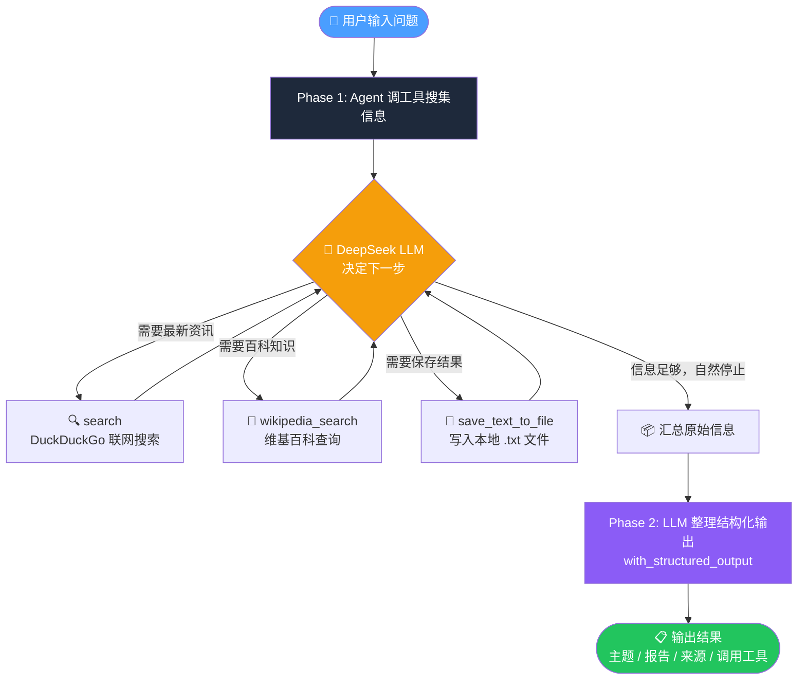

# Answer Agent 答案代理

一个基于 **LangChain + DeepSeek** 的入门级 AI Agent demo，展示「LLM + 工具调用 + 结构化输出」三件套的最小可运行实现。

## 效果演示

```
您想要研究什么主题？帮我研究 LangChain 的应用，并保存到文件中

[系统提示] Agent 开始思考并查阅资料...

  🤔 决定调用: wikipedia_search（{'query': 'LangChain'}）
  🔧 调用工具: wikipedia_search
  🤔 决定调用: search（{'query': 'LangChain 应用场景 2024'}）
  🔧 调用工具: search

[系统提示] 正在整理结构化结果...

==================== 格式化研究结果 ====================
【研究主题】: LangChain 的应用
【详细报告】: LangChain 是一个用于构建 LLM 应用的框架...
【参考来源】: ['https://...', 'https://...']
【调用工具】: ['wikipedia_search', 'search']
```

## 架构



## 项目结构

```
answer-agent/
├── main.py          # Agent 主入口，定义结构化输出格式
├── tools.py         # 三个工具：联网搜索 / 维基百科 / 保存文件
├── requirements.txt # 依赖列表
├── .env.example     # 环境变量模板
└── README.md
```

## 快速开始

### 1. 克隆项目

```bash
git clone https://github.com/your-username/answer-agent.git
cd answer-agent
```

### 2. 创建虚拟环境并安装依赖

```bash
python -m venv venv
source venv/bin/activate  # Windows: venv\Scripts\activate
pip install -r requirements.txt
```

### 3. 配置 API Key

```bash
cp .env.example .env
```

编辑 `.env`，填入你的 DeepSeek API Key：

```
DEEPSEEK_API_KEY=sk-your-key-here
```

> 获取 API Key：[platform.deepseek.com](https://platform.deepseek.com)

### 4. （可选）配置代理

如果访问 DuckDuckGo / Wikipedia 需要代理，编辑 `tools.py` 顶部：

```python
PROXY = "http://127.0.0.1:你的端口"  # 没有代理则改为 None
```

### 5. 运行

```bash
python main.py
```

## 工具说明

| 工具 | 触发时机 | 底层实现 |
|---|---|---|
| `search` | 查最新资讯、实时事件 | DuckDuckGo (`ddgs`) |
| `wikipedia_search` | 查概念、人物、背景知识 | `wikipedia` 库（中文） |
| `save_text_to_file` | 保存报告到本地 | 写入 `.txt` 文件 |

## 技术栈

- [LangChain](https://github.com/langchain-ai/langchain) — Agent 框架
- [DeepSeek](https://platform.deepseek.com) — 大语言模型
- [DuckDuckGo Search](https://github.com/deedy5/duckduckgo_search) — 联网搜索
- [Pydantic](https://docs.pydantic.dev) — 结构化输出校验

## 和完整 Agent 的差距

这是一个**入门 demo**，有意保持简洁。以下是已知的局限，欢迎 PR：

- [ ] 多轮对话记忆（Memory）
- [ ] ReAct 推理循环（观察 → 思考 → 行动）
- [ ] 工具失败自动重试
- [x] 流式输出（Streaming）— 实时显示每次工具调用
- [ ] Human-in-the-loop 确认机制

## License

MIT
